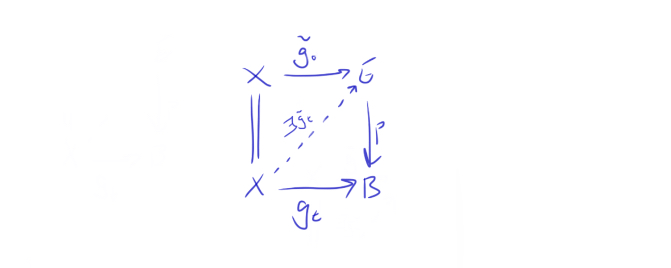

+++
author = "Elias Klakken Angelsen"
title = "Spectral sequences and multicomplexes - Part I"
date = "2022-02-02"
description = "We start the blog by diving into spectral sequences, heading for understanding a master thesis on the topic."
tags = [
    "Algebraic Topology",
    "Spectral sequences",
    "Fibrations",
    "Multicomplexes",
    "Reading a master thesis",
    "Mathematics",
]
categories = [
    "Spectral sequences",
    "Math",
]
series = ["Short series - Spectral sequences and multicomplexes"]
aliases = ["splasher"]
image = "splasher.jpg"
math = true
draft = true
+++
**Fix title photo to be specseqds from GD, insert images!**

A year ago, I took a course on algebraic topology at NTNU where we covered some homotopy theory, spectral sequences, bundle theory and characteristic classes. 
Most of the topics stuck with me, and I have been exploring them a bit after the course. Spectral sequences was one of the topics that fascinated me the most, as they give a puzzle-style way of computing homology and cohomology.
Even though I realised that they were powerful tools, there were a lot of technicalities that I just "accepted" when it came to spectral sequences. 
I have not been using them, or even thinking about them, for a while now, and I thought it would be nice to "open the blackbox" to understand them.

A fellow student of mine, Odin, recently handed in his master thesis in algebraic topology where he explored the spectral sequence associated to a multicomplex over a field.
Trying to understand the main essence of the results in his thesis, is what lead me to writing this post. 
We will start the mathematical exploration of this blog with a small introduction to spectral sequences before we delve into the main results in Odins master thesis.

First we give a glimpse at where we are going in this post and briefly explain the idea of a spectral sequence through the Leray-Serre spectral sequence before moving on to constructing spectral sequences from filtered complexes. 
After this, we detour to an alternative approach of using exact couples, before we return to the derivation of the Leray-Serre sequence.  

## What is a spectral sequence?

Loosely speaking, a (co)homological spectral sequence consists several *pages* of chain complexes of abelian groups such that the pages are connected by (co)homology.
The idea we will try to capsule into the spectral sequence is that we will make a finer and finer approximation to the homology of a space. 
Between the abelian groups, we have differentials that "shift" their angle for each page we iterate through, allowing us to gather up some new (finer) info in homology for each page.

To reveal some of the notation before we derive the ideas ourselves, it is common (up to convention) to write $(E^r_{**}, d^r_{* *})$. This indicates that we would have abelian groups $E^r_{p,q}$ and differentials $d^r_{p,q} : E^r_{p,q} \to E^r_{p-r,q+r-1}$ squaring to zero on the $r$'th page.
The example we will come back to and try out a bit, is the Leray-Serre spectral sequence. This may often be stated as a theorem, as its convergence is certainly not to take for granted.

**INSERT PHOTOS OF DIFFERENTIALS, GRIDS, ETC...**

**Theorem: (The Leray-Serre Spectral Sequence)**

Assume $F \hookrightarrow E \to B$ is a fibration where $\pi_0(E) = 0$ and $\pi_1(B)=0$ (even better, assume that $\pi_1(B)$ acts trivially on $H_*(F)$ and the result still holds).

Then there is a convergent first quadrant spectral sequence with $E^2$-page given by
$$ E^2_{p,q} = H_p(B;H_q(F)) \Rightarrow H_{p+q}(E).$$
 
Ok, we have some words to clarify before we understand this.
What is a fibration? What does it mean for a spectral sequence to be first quadrant, and how would such a weird mix-up of homology groups converge to anything, let alone the homology of $E$? 
There are a lot of questions to be answered, but we'll come back to them. 

## A detour to homotopy theory

Even though you can do a post about spectral sequences without touching that much topology, we want to visit homotopy theory to grasp what this could mean.
Fibrations come from homotopy theory, and along with the notions of weak equivalences and cofibrations (the dual notion of fibrations), they make up the stepping stones for the theory. 
In fact, if we would want to do homotopy theory in other contexts (that is, in other categories), we couldn't necessarily just "continuously deform" or "draw a continuous path" between homotopic functions. 
We would need the categorical notion of a model category, which is specified by fibrations, cofibrations and weak equivalences. We may encounter them in later posts, but for now, we won't dwell on these ideas.

**Definition: (Homotopy Lifting Property)**

Given a map of topological spaces $p: E \to B$, we say $p$ has the *homotopy lifting property* with respect to a space $X$ if, given a homotopy $g_t: X \to B$ and a lift $\tilde{g_0}:X \to E$ of the starting map $g_0$ in the homotopy, 
there exists a homotopy $\tilde{g_t}:X \to E$ lifting $g_t$ and extending $\tilde{g_0}$. Phrased as a diagram, 

**Definition: (Fibration)** 

A *fibration* $p: E \to X$ is a map having this homotopy lifting property with respect to all topological spaces $X$.

We call $F_x := p^{-1}(x)$ the fiber at $x$. If the base space $B$ is path connected, the different fibers are all homotopy equivalent. 
This leads us to talk about just *the* fiber $F$ and this justifies the notation $F \hookrightarrow E \to B$ for fibrations.

One of the most known fibrations is the Hopf fibration, 
$S^1 \hookrightarrow S^3 \to S^2$, 
where the last morphism can be given explicitely.

The idea of spectral sequences is now that we can utilize the homology of $B$ and $F$ to find the homology of $E$, or even reverse-engineer it to find the homology of one of them, given that we know the homology of the two others.
This is exactly what we will do when we later compute the homology of the loop space $\Omega S^n = Hom_{Top_*}(S^1,S^n)$.

To try to visualise this idea, think of a fiber bundle $p: E \to B$. If you do not know what a fiber bundle is, think about a manifold $B$ where the total space $E$ is the space $B$, but now every point has a fiber $F$ glued on. 
The map $p$ then becomes just taking a point $(b,F_b)$ and projecting down to $b$. Throw in some localising conditions (conditions to make sure we locally glue them on in the same direction), and tada, you basically have the definition of a fiber bundle.
If the fibers are vector spaces, we call them vector bundles. Think about them as the collection of all (co)tangent spaces on your manifold. This construction is quite important, so we will meet it again later, for sure.

One can show that all fiber bundle maps over paracompact base spaces are fibrations. 
The lifting condition now says that if we have a homotopy $g_t$ on our base space $B$, and a way to start the homotopy in the total space $E$, we can lift the homotopy to $E$.
Even though the homotopy is between functions, I like to think of them as lines. This would then mean that if we knew "a line" in $B$ and where it starts in $E$, we can transfer the entire "line" up to $E$ through the fibration $p$.
Now, enough with the hand waving and the homotopy theory for now. Let's get back to spectral sequences.

## Spectral sequences from filtered complexes

Recall that we often find ourselves in situations where we have a space $X$ and a subspace $A$. Often, we also can consider triplets of spaces $A \subset B \subset X$.
These will both yield long exact sequences in homology that relate the homology of these spaces. Note that if we consider the singular $n$-chains, we will get a sequence of inclusions 
$C_n(A) \hookrightarrow C_n(B) \hookrightarrow C_n(X)$.
Indeed, if we avoid choosing an $n$, we get a sequence of chain complexes $C_ * (A) \hookrightarrow C_ * (B) \hookrightarrow C_*(X)$ that contain a lot of the homological information relating these. 
If we want, we can apply homology to get a sequence looking quite similar.
A natural question to ask is whether or not we can try to utilize this sort of filtration to compute homology levelwise and make it "converge" to the homology of $X$.

We need a few definitions before unwinding the magic.

**Definition: (Filtration of a module)**

A *filtration* of a module $M$ is a sequence of subspaces

$$\cdots \subset F_{-1}M \subset F_0M \subset F_1M \subset \cdots$$

such that their union is $M$ and their intersection is $\empty$.

**Definition: (Filtered complex)**

A filtered complex is a chain complex $(C,\partial)$  such that we have a filtration on each entry preserving the boundary map, i.e. each $C_i$ has a filtration such that $\partial F_jC_i \subset F_jC_{i-1}$.

One should note that $F_pC_ * $ is a subcomplex of $C_*$, so we have basically just filtered the entire complex at the same time. 

**Definition: (Associated graded module)**

Given a filtration on a module $M$, we can define the *associated graded module* 

$$GM = \bigoplus_{i \in \mathbb{Z}}G_iM,$$

where $G_iM = F_iM/F_{i-1}M$.

As in the previous case, we can do the same thing for complexes.

**Definition: (Associated graded complex)**

Given a filtered complex $C_*$, we can define the *associated graded complex*

$$G_pC_* = F_pC_* / F_{p-1}C_* , $$

where the quotient is taken as chain complexes.

**Remark:** The filtration on $C_ * $ induces a filtration on its homology, so we can in fact talk about the graded structures on the homology of $C_* $ as well.

To enlighten the power of the above definitions, recall that if we consider a (good) pair of spaces $A \subset X$, we can in fact compute $H(X)$ from $H(A)$ and $H(X/A)$.
Therefore, the graded constructions we mention above try to generalise this concept. If we can pick a filtration of $C_ * $ with easily computeable homology, maybe we can compute the homology of $C_ *$ itself!

Recall that a spectral sequence is supposed to consist of a grid of abelian groups (or modules) $E^r_{p,q}$ with differentials $d^r_{p,q} : E^r_{p,q} \to E^r_{p-r,q+r-1}$, whatever that means. 
Since the differentials shift and move further and further away as we progress towards the pages, a suitable boundedness condition may ensure that all of these differentials vanish, at some point.
For example, this happens in the Leray-Serre sequence, as that spectral sequence is a first quadrant sequence. 

**Continue to follow [this](https://r0hilp.github.io/assets/docs/serre_spectral_sequence.pdf)**

Perhaps end with explaining that we are going to rpvoe Leray-Serre two ways in the next post.

Next post - Pf through gradeds, pf through exact couples and cohom of loop space on n-sphere?

## Spectral sequences from exact couples? 

## An example (fibrations yield SS...)

### A computation (Perhaps the cohomology (not ring struc) of $\Omega S^1$)

## Spectral sequences from chain complexes

## Spectral sequences from double complexes

## What about multicomplexes?

Perhaps for later articles:

* Spectral sequences for multicomplexes
* Why may the differentials be wonky? Ref. toy examples in Odins thesis
* Can we do a ninja trick?
* HTTT (Homotopy transfer theorem)
* Shifted seq to understand $d_2$(?)
* Iterated shifts TLDR and higher differentials
* Category SpSeq?

Also, why would a topologist care?