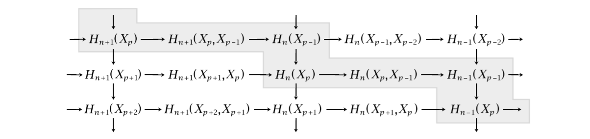
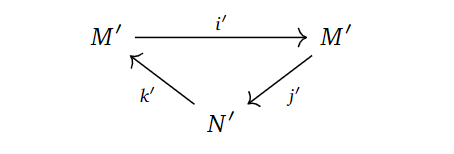

+++
author = "Elias Klakken Angelsen"
title = "Spectral sequences and multicomplexes - Part II"
date = "2022-02-04"
description = "We continue our exposition of spectral sequences with proving the convergence of the Leray-Serre spectral sequence and computing an example."
tags = [
    "Algebraic Topology",
    "Spectral sequences",
    "Fibrations",
    "Multicomplexes",
    "Reading a master thesis",
    "Mathematics",
]
categories = [
    "Spectral sequences",
    "Math",
]
series = ["Short series - Spectral sequences and multicomplexes"]
aliases = ["Spectral sequences"]
image = "images/ExactCouple.png"
math = true
draft = true
+++

**Fix the title, tags, cats, front image, reading through, etc..**

Welcome back! In the previous post, we took a brief look at spectral sequences and how we could get them from filtered complexes.
In this post, we will prove the convergence of the Leray-Serre (LS) spectral sequence using techiques from homotopy theory, explore the more general approach of finding spectral sequences through derived couples and last, but not least, we will compute a quite illustrative example.
We have not yet gone outside the curriculum from the [course](https://wiki.math.ntnu.no/ma3408/2021v/start) I took last year, as we both proved the LS-sequence converged and we mentioned (although briefly) exact couples a bit. Nevertheless, I want to explore these topics, to really understand them.
If you just want to see the computation, feel free to skip to the last chapter.

## Proving the convergence of the Leray-Serre spectral sequence using homotopy theory
We start by proving the theorem we stated in the previous post using the method of constructing a spectral sequence from a filtered complex.

**Theorem: (The Leray-Serre Spectral Sequence)**

Assume $F \hookrightarrow E \to B$ is a fibration where $\pi_0(E) = 0$ and $\pi_1(B)=0$ (even better, assume that $\pi_1(B)$ acts trivially on $H_*(F)$ and the result still holds).

Then there is a convergent first quadrant spectral sequence with $E^2$-page given by
$$ E^2_{p,q} = H_p(B;H_q(F)) \Rightarrow H_{p+q}(E).$$

***Proof:** (Following [this](https://r0hilp.github.io/assets/docs/serre_spectral_sequence.pdf) article)*

We are given a fibration $p: E \to B$ with fiber $F$. For simplicity's sake, assume $B$ is a CW-complex. Strictly speaking, this [can be done](https://pi.math.cornell.edu/~hatcher/AT/AT-CWapprox.pdf) as every space we are interested in at the moment can be considered to be weakly equivalent to a CW-complex.
Let $B^p$ denote the $p$-skeleton. Take the singular chain complex of $E$, $C_* (E)$ and define a filtration on this complex. 

How? Well, we want to understand how it changes *levelwise*, that is, how it changes when going from $B^{p-1}$ to $B^{p}$. 
We could take the relative chains $C_* (B^p,B^{p-1})$ to be some sort of graded, but as $B^p$ and $B^{p-1}$ does not really live in $E$, and hence, we are not working with $C_* (E)$. If we remember that we have the fibration $p: E \to B$, we can just pull these skeleta back through $p$.
Then, define $G_pC_* (E) = C_* (p^{-1}(B^p),p^{-1}(B^{p-1}))$ to be the associated graded complex. Indeed, if we just took the simple route and started with the filtration $F_pC_* (E) = C_* (p^{-1}(B^p))$, we will retrieve the same associated graded complex!

By computing homology, we achieve the entries in the $E^1$-page as

$$E_{p, q}^{1}=H_{p+q}\left(p^{-1}\left(B^p\right), p^{-1}\left(B^{p-1}\right)\right).$$

The differential is achieved the same way as last time, where we composed two maps coming from different long exact sequences in homology. That is, $d_1$ is the composition

$$H_{p+q}\left(p^{-1}\left(B^{p}\right), p^{-1}\left(B^{p-1}\right)\right) \rightarrow H_{p+q-1}\left(p^{-1}\left(B^{p-1}\right)\right)$$
$$ \rightarrow H_{p+q-1}\left(p^{-1}\left(B^{p-1}\right), p^{-1}\left(B^{p-2}\right)\right).$$

We can of course just continue finding the rest of the pages and their differentials, as this will converge to $H_{p+q}(C_* (E)) = H_{p+q}(E)$ due to the fact that we built our filtration on $p^{-1}(B^p)$, which will increase to $E$ as $p$ increases, 
but this does not reference the explicit construction of the $E^2$-page that should be quite easy to compute. 
Hence, we are going to show that the $E^2$-page can be written quite explicitely as $E^2_{p,q} = H_p(B;H_q(F))$.

This is defintitely the [crux](https://en.wikipedia.org/wiki/Crux_(climbing)) of the proof (for us), as we would need to show that the $E^1$-page consists of the cellular chain group $C_{p}^{C W}\left(B ; H_{q}(F)\right)$, as this would yield the wanted $E^2$-page.
This in turn follows from the fact that cellular homology coincides with singular homology.

Note that we have 

$$C_p^{CW}(B;H_q(F)) \cong H_p(B^p, B^{p-1}) \otimes H_q(F) $$

by the [definition](https://topospaces.subwiki.org/wiki/Cellular_chain_complex) of the cellular chains with coefficients.

It is known to the barely [cognoscenti](https://www.dictionary.com/browse/cognoscenti) that $H_p(B^p, B^{p-1})$ is freely generated by the $p$-cells of $B$, it is isomorphic to copies of a direct sum of $\mathbb{Z}$, indexed over some $\alpha$'s.
Therefore, we have $C_p^{CW}(B;H_q(F)) \cong \oplus_{\alpha}H_q(F)$.

Now, to analyse this further, consider the characteristic map $\phi_{\alpha}$ of $D_{\alpha}$, that is, the map indicating how to glue on the $p$-cell $D_{\alpha}$ to $B^{p-1}$.

We can use this, along with the fibration, to consider the following pullback diagram.

Why is this fun to do? Well, we want to connect the $p$-cells generating the cellular chain groups with $(p^{-1}(B^p), p^{-1}(B^{p-1}))$, and pullbacking may yield some "middle ground" that we can utilise towards this purpose.
To keep notation consistent and remember *how* we glued on $D_{\alpha}$, the preimage $\xi_{\alpha}(S_{\alpha}) = \xi_{\alpha}(\partial D_{\alpha})$ is denoted by $\tilde{S_{\alpha}}$.

If we consider all the pairs $(\tilde{D_{\alpha}}, \tilde{S_{\alpha}})$, we can map them over to $(p^{-1}(B^p), p^{-1}(B^{p-1}))$ using the $\phi_{\alpha}$'s.
That is, we combine them to one map 

$$\phi^* : \coprod_{\alpha}(\tilde{D_{\alpha}}, \tilde{S_{\alpha}}) \to (p^{-1}(B^p), p^{-1}(B^{p-1})).$$

In fact, this map of pairs of spaces is actually an isomorphism when passed through $H_{p+q}$.
This is because we can do a ninja-trick or two, showing that we can apply excision to the right hand side, yielding the same homology groups. We won't go into the details, as the crux (of what we actually show) is behind us.

The last step involves showing

$$\oplus_{\alpha}  H_{p+q}(\tilde{D_{\alpha}}, \tilde{S_{\alpha}}) \cong \oplus_{\alpha} H_{q}(F).$$

To briefly explain why this is true, one can do some tricks making an upper and lower hemisphere of the $\tilde{D_{\alpha}}$'s by using the $\xi_{\alpha}$'s, denoted by $\tilde{D_{\alpha,-}}$.
We get the following picture, stolen from [Hatchers chapter on spectral sequences](https://pi.math.cornell.edu/~hatcher/AT/ATch5.pdf), showing a zig-zag tracing down a simpler version of the homology groups we are after. 
We omit the index $\alpha$, but include a superscript to log which cells we work with.

The space $H_q(\tilde{D_+^0})$ can be shown to be exactly $H_q(F)$ by utilising the maps $\phi_{\alpha}$, as well as the assumption that $\pi_1(B)$ is trivial, or at least acts trivially on the homology $H_* (F)$.
We won't delve into it any more, but we refer to [Hatcher](https://pi.math.cornell.edu/~hatcher/AT/ATch5.pdf) for the details.

Combining the isomorphisms, we get 

$$C_p^{CW}(B;H_q(F)) \cong H_p(B^p, B^{p-1}) \otimes H_q(F) \cong \oplus_{\alpha}H_q(F)$$
$$\cong \oplus_{\alpha} H_{q}(F) \cong \oplus_{\alpha}  H_{p+q}(\tilde{D_{\alpha}}, \tilde{S_{\alpha}}) \cong  H_{p+q}(\coprod_{\alpha}(\tilde{D_{\alpha}}, \tilde{S_{\alpha}}))$$
$$ \cong H_{p+q}(p^{-1}(B^p), p^{-1}(B^{p-1})) \cong E_{p,q}^1.$$

The differential $d_1$ coincides with the cellular boundary map $\partial$ as well, yielding the same homology, hence giving the wanted $E^2$-page!
We won't show this, as it is quite technical, but it can be found in [Hatchers chapter](https://pi.math.cornell.edu/~hatcher/AT/ATch5.pdf). 
The same can be said about showing this construction is well-defined with respect to choosing a different CW-approximations to $B$.

## Spectral sequences from exact couples - A more general approach
As we just saw, the previous method of finding the Leray-Serre spectral sequence involved some technical homotopy theory, and that is after we referenced most parts to Hatcher!
Are there other ways to find such spectral sequences? Yes, indeed, there is an alternative way through *exact couples*. 
It turns out that we can derive all interesting spectral sequences this way.

The method is based on the following staircase diagram, which we borrow from [Hatcher](https://pi.math.cornell.edu/~hatcher/AT/ATch5.pdf).
For this section, let $X$ be a finite dimensional CW-complex.

If we denote $M = \oplus_{p,q} H_p+q(X_p)$ and $N = \oplus_{p,q} H_p+q(X_p,X_{p-1})$, we can put these staircases together into one diagram, where the arrows are the ones coming from the staircase drawing. 
Since there are only two objects involved and the diagram is exact in every object, this is called an exact couple.

One can actually note that the vertical maps in the drawing of the staircase diagrams, correspond to the cellular differentials.
Hence, studying $d=jk$ in the exact couple, could be quite interesting. Indeed, since $kj=0$, we obtain $d^2=jkjk=j0k=0$, meaning we can form the homology group.
This yields a sequence $\cdots \to N \to N \to N \to \cdots$, where each map is the differential $d=jk$. 

Forming the homology groups, we obtain what we call a *derived couple*.

In the derived couple, we try to define things in the "only way" we can, namely as, 

$N' = \frac{Ker d_0}{Im d_0}, \quad M' = Im(i)=Ker(j), \quad i' = i |_{M'}, \quad j'=ji^{-1}, \quad k' = \bar{k},$

where $\bar{k}$ is $k$, but just on homology classes and $i^{-1}$ means picking an element in the preimage.
These constructions turns out to be well-defined with respect to choosing representatives for the homology classes and preimages, 
simply by writing out what they should mean and applying exactness. 

By some diagram chasing, it turns out that the derived couple is exact! Hence, homology takes in an exact couple and spits out an exact couple!
Doing the same procedure with $d'=j'k'$, we can make a new derived couple with entries $M'', N''$ and maps $i'', j'', k''$, yielding an exact sequence!

**Why tf does the diff turn?**

To me, there are a few questions that need to be answered. Does this spectral sequence converge to anything, and why does the differential shift, as we know it should.

### A detour to more general cohomology theories.

**Take one more look at this, understand it pls**
To explain some of the power of this construction, we have really only used that $H_* $ has a long exact sequence for pairs. 
Hence, we can actually take any cohomology theory $\mathcal{E}_ * $ and do a similar thing. Strictly speaking, this would give us a *cohomological* spectral sequence looking like

$$E_2^{p, q}=H^p\left(X ; \pi_{-q} \mathcal{E}\right) \Rightarrow \mathcal{E}^{p+q}(X),$$

where $\mathcal{E}$ is the spectra representing the cohomology theory, and the coefficients are given by the homotopy groups of spectra, where we have defined 

$$\pi_k(\mathcal{E})=\operatorname{colim}_{n \rightarrow \infty} \pi _ {n+k} (\mathcal{E}_n)$$

for all $k \in \mathbb{Z}$.

We won't jump into the homotopy theory going on here, but the idea still holds if we ignore working with the coefficients and the convergence.

By defining 

$$M = \oplus_{p, q}\mathcal{E}^ {p+q}(X_ p ), \quad N = \oplus_{p, q}\mathcal{E}^{p+q}(X_p,X _ {p-1} ),$$

and letting the maps come from the setup of a cohomological staircase diagrams. 

In fact, letting $E_{p,q}^1 = \mathcal{E}_ {p+q} (X_p,X _ {p-1}) $ be the first page of the spectral sequence, we can just iterate the construction as mentioned earlier to retrieve a spectral sequence
in the cohomology theory $ \mathcal{E}_ * $!

### Leray-Serre through exact couples.

We keep it brief.
 

## Computing the homology of $\Omega S^n$.

Perhaps for later articles:
Spectral sequences from chain complexe
Spectral sequences from double complexes

What about multicomplexes?

* Spectral sequences for multicomplexes
* Why may the differentials be wonky? Ref. toy examples in Odins thesis
* Can we do a ninja trick?
* HTTT (Homotopy transfer theorem)
* Shifted seq to understand $d_2$(?)
* Iterated shifts TLDR and higher differentials
* Category SpSeq?

Also, why would a topologist care?