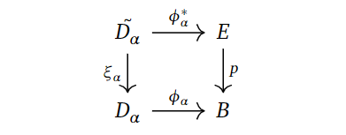

+++
author = "Elias Klakken Angelsen"
title = "Spectral sequences and multicomplexes - Part II"
date = "2022-02-04"
description = "We continue our exposition of spectral sequences with proving the convergence of the Leray-Serre spectral sequence and computing an example."
tags = [
    "Algebraic Topology",
    "Spectral sequences",
    "Fibrations",
    "Multicomplexes",
    "Reading a master thesis",
    "Mathematics",
]
categories = [
    "Spectral sequences",
    "Math",
]
series = ["Short series - Spectral sequences and multicomplexes"]
aliases = ["Spectral sequences"]
image = "images/ExactCouple.png"
math = true
draft = true
+++

**Fix the title, tags, cats, front image, reading through, etc..**

Welcome back! In the previous post, we took a brief look at spectral sequences and how we could get them from filtered complexes.
In this post, we will sketch the main ideas in a proof of the convergence of the Leray-Serre (LS) spectral sequence using techiques from homotopy theory, and compute a quite illustrative example.
If you just want to see the computation, feel free to skip to the last chapter.

## Proving the convergence of the Leray-Serre spectral sequence using homotopy theory
We start by proving the theorem we stated in the previous post using the method of constructing a spectral sequence from a filtered complex.

**Theorem: (The Leray-Serre Spectral Sequence)**

Assume $F \hookrightarrow E \to B$ is a fibration where $\pi_0(E) = 0$ and $\pi_1(B)=0$ (even better, assume that $\pi_1(B)$ acts trivially on $H_*(F)$ and the result still holds).

Then there is a convergent first quadrant spectral sequence with $E^2$-page given by
$$ E^2_{p,q} = H_p(B;H_q(F)) \Rightarrow H_{p+q}(E).$$

***Proof:** (Following [this](https://r0hilp.github.io/assets/docs/serre_spectral_sequence.pdf) article)*

We are given a fibration $p: E \to B$ with fiber $F$. For simplicity's sake, assume $B$ is a CW-complex. Strictly speaking, this [can be done](https://pi.math.cornell.edu/~hatcher/AT/AT-CWapprox.pdf) as every space we are interested in at the moment can be considered to be weakly equivalent to a CW-complex.
Let $B^p$ denote the $p$-skeleton. Take the singular chain complex of $E$, $C_* (E)$ and define a filtration on this complex. 

How? Well, we want to understand how it changes *levelwise*, that is, how it changes when going from $B^{p-1}$ to $B^{p}$. 
We could take the relative chains $C_* (B^p,B^{p-1})$ to be some sort of graded, but as $B^p$ and $B^{p-1}$ does not really live in $E$, and hence, we are not working with $C_* (E)$. If we remember that we have the fibration $p: E \to B$, we can just pull these skeleta back through $p$.
Then, define $G_pC_* (E) = C_* (p^{-1}(B^p),p^{-1}(B^{p-1}))$ to be the associated graded complex. Indeed, if we just took the simple route and started with the filtration $F_pC_* (E) = C_* (p^{-1}(B^p))$, we will retrieve the same associated graded complex!

By computing homology, we achieve the entries in the $E^1$-page as

$$E_{p, q}^{1}=H_{p+q}\left(p^{-1}\left(B^p\right), p^{-1}\left(B^{p-1}\right)\right).$$

The differential is achieved the same way as last time, where we composed two maps coming from different long exact sequences in homology. That is, $d_1$ is the composition

$$H_{p+q}\left(p^{-1}\left(B^{p}\right), p^{-1}\left(B^{p-1}\right)\right) \rightarrow H_{p+q-1}\left(p^{-1}\left(B^{p-1}\right)\right)$$
$$ \rightarrow H_{p+q-1}\left(p^{-1}\left(B^{p-1}\right), p^{-1}\left(B^{p-2}\right)\right).$$

We can of course just continue finding the rest of the pages and their differentials, as this will converge to $H_{p+q}(C_* (E)) = H_{p+q}(E)$ due to the fact that we built our filtration on $p^{-1}(B^p)$, which will increase to $E$ as $p$ increases, 
but this does not reference the explicit construction of the $E^2$-page that should be quite easy to compute. 
Hence, we are going to show that the $E^2$-page can be written quite explicitely as $E^2_{p,q} = H_p(B;H_q(F))$.

This is defintitely the [crux](https://en.wikipedia.org/wiki/Crux_(climbing)) of the proof (for us), as we would need to show that the $E^1$-page consists of the cellular chain group $C_{p}^{C W}\left(B ; H_{q}(F)\right)$, as this would yield the wanted $E^2$-page.
This in turn follows from the fact that cellular homology coincides with singular homology.

Note that we have 

$$C_p^{CW}(B;H_q(F)) \cong H_p(B^p, B^{p-1}) \otimes H_q(F) $$

by the [definition](https://topospaces.subwiki.org/wiki/Cellular_chain_complex) of the cellular chains with coefficients.

It is known to the barely [cognoscenti](https://www.dictionary.com/browse/cognoscenti) that $H_p(B^p, B^{p-1})$ is freely generated by the $p$-cells of $B$, it is isomorphic to copies of a direct sum of $\mathbb{Z}$, indexed over some $\alpha$'s.
Therefore, we have $C_p^{CW}(B;H_q(F)) \cong \oplus_{\alpha}H_q(F)$.

Now, to analyse this further, consider the characteristic map $\phi_{\alpha}$ of $D_{\alpha}$, that is, the map indicating how to glue on the $p$-cell $D_{\alpha}$ to $B^{p-1}$.

We can use this, along with the fibration, to consider the following pullback diagram.

Why is this fun to do? Well, we want to connect the $p$-cells generating the cellular chain groups with $(p^{-1}(B^p), p^{-1}(B^{p-1}))$, and pullbacking may yield some "middle ground" that we can utilise towards this purpose.
To keep notation consistent and remember *how* we glued on $D_{\alpha}$, the preimage $\xi_{\alpha}(S_{\alpha}) = \xi_{\alpha}(\partial D_{\alpha})$ is denoted by $\tilde{S_{\alpha}}$.

If we consider all the pairs $(\tilde{D_{\alpha}}, \tilde{S_{\alpha}})$, we can map them over to $(p^{-1}(B^p), p^{-1}(B^{p-1}))$ using the $\phi_{\alpha}$'s.
That is, we combine them to one map 

$$\phi^* : \coprod_{\alpha}(\tilde{D_{\alpha}}, \tilde{S_{\alpha}}) \to (p^{-1}(B^p), p^{-1}(B^{p-1})).$$

In fact, this map of pairs of spaces is actually an isomorphism when passed through $H_{p+q}$.
This is because we can do a ninja-trick or two, showing that we can apply excision to the right hand side, yielding the same homology groups. We won't go into the details, as the crux (of what we actually show) is behind us.

The last step involves showing

$$\oplus_{\alpha}  H_{p+q}(\tilde{D_{\alpha}}, \tilde{S_{\alpha}}) \cong \oplus_{\alpha} H_{q}(F).$$

To briefly explain why this is true, one can do some tricks making an upper and lower hemisphere of the $\tilde{D_{\alpha}}$'s by using the $\xi_{\alpha}$'s, denoted by $\tilde{D_{\alpha,-}}$.
We get the following picture, stolen from [Hatchers chapter on spectral sequences](https://pi.math.cornell.edu/~hatcher/AT/ATch5.pdf), showing a zig-zag tracing down a simpler version of the homology groups we are after. 
We omit the index $\alpha$, but include a superscript to log which cells we work with.

The space $H_q(\tilde{D_+^0})$ can be shown to be exactly $H_q(F)$ by utilising the maps $\phi_{\alpha}$, as well as the assumption that $\pi_1(B)$ is trivial, or at least acts trivially on the homology $H_* (F)$.
We won't delve into it any more, but we refer to [Hatcher](https://pi.math.cornell.edu/~hatcher/AT/ATch5.pdf) for the details.

Combining the isomorphisms, we get 

$$C_p^{CW}(B;H_q(F)) \cong H_p(B^p, B^{p-1}) \otimes H_q(F) \cong \oplus_{\alpha}H_q(F)$$
$$\cong \oplus_{\alpha} H_{q}(F) \cong \oplus_{\alpha}  H_{p+q}(\tilde{D_{\alpha}}, \tilde{S_{\alpha}}) \cong  H_{p+q}(\coprod_{\alpha}(\tilde{D_{\alpha}}, \tilde{S_{\alpha}}))$$
$$ \cong H_{p+q}(p^{-1}(B^p), p^{-1}(B^{p-1})) \cong E_{p,q}^1.$$

The differential $d_1$ coincides with the cellular boundary map $\partial$ as well, yielding the same homology, hence giving the wanted $E^2$-page!
We won't show this, as it is quite technical, but it can be found in [Hatchers chapter](https://pi.math.cornell.edu/~hatcher/AT/ATch5.pdf). 
The same can be said about showing this construction is well-defined with respect to choosing a different CW-approximations to $B$.

## Computing the homology of $\Omega S^n$.

To use the Leray-Serre sequence to compute the homology of $\Omega S^n$, we need a fibration where we can put this space.
The fibration we will use is the path space fibration, namely $\Omega X \to PX \to X$, for a based space $X$.
The path space $PX$ is given by continuous maps from $[0,1]$ to $X$ sending $0$ to the base point of $X$. The last map in the fibration is then given by evaluating the path in $1$.
This space is contractible, which is going to be important for our computation. The loop space is the fiber of this map at the basepoint, and is therefore defined as continuous (based) maps $S^1 \to X$.

If we choose $X$ to be an arbitrary sphere $S^n$, we want to try to compute its homology.

Ok, what do we need to do? Well, if we want to use the Leray-Serre spectral sequence, we know that it is given by
$$ E^2_{p,q} = H_p(B;H_q(F)) \Rightarrow H_{p+q}(E).$$

For this fibration, this would look like

$$ E^2_{p,q} = H_p(S^n;H_q(\Omega S^n)) \Rightarrow H_{p+q}(PS^n) = H_{p+q}( * ).$$

We certainly know the homology of the sphere and the path space, as the path space has the same homology as the point, so we would need to utilise the differentials
in order to say anything about the homology of $\Omega S^n$.

Now, what does the second page look like? By the universal coefficient theorem, we can find the $E^2$-page.
The entries on the page is given by $H_q(\Omega S^n)$ if $p=0, n$ and $q \geq 0$, and $0$ elsewhere.

**INSERT E^2-PAGE**

Since this is the $E^2$-page, some magic would need to happen before arriving at the $E^{\infty}$-page.

