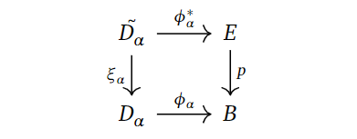
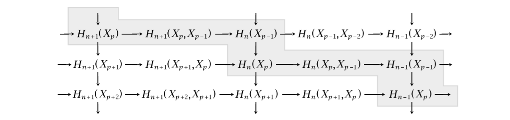
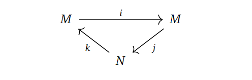
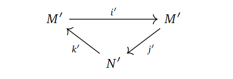
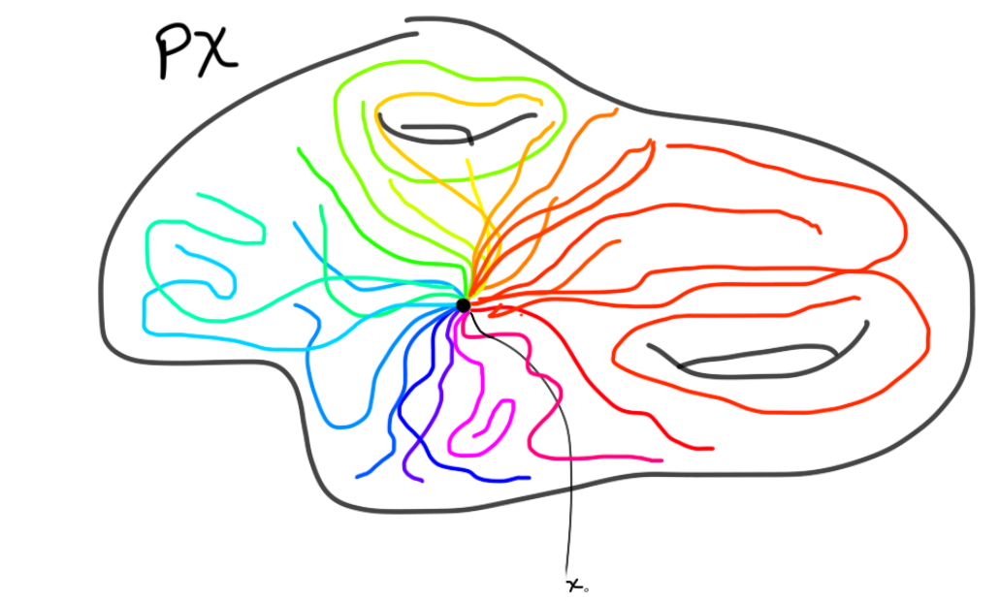
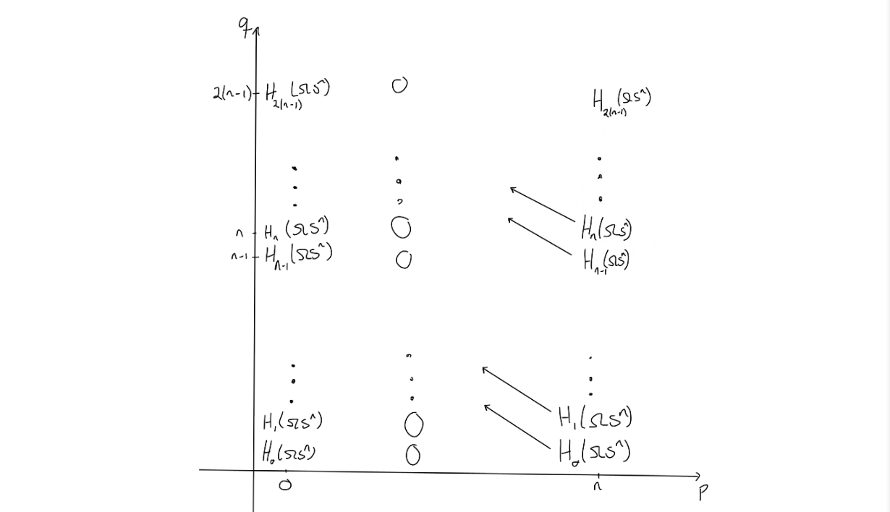
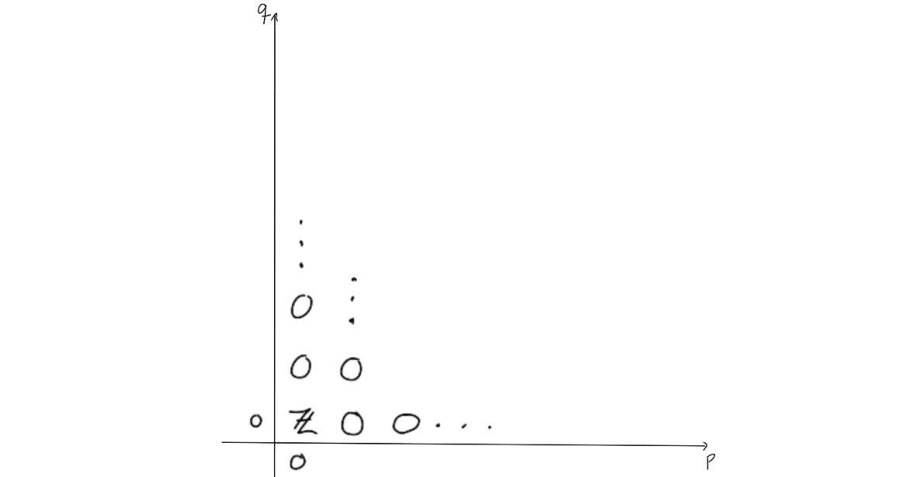
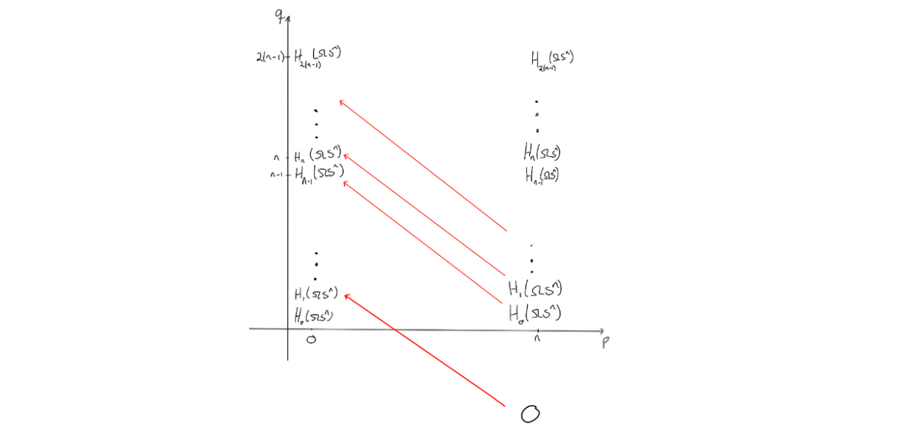
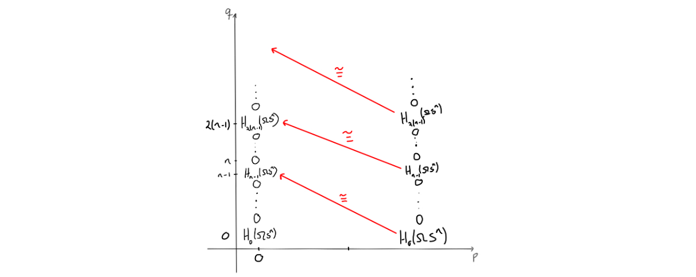

+++
author = "Elias Klakken Angelsen"
title = "Spectral sequences and multicomplexes - Part II"
date = "2022-02-23"
description = "We continue our exposition of spectral sequences by proving the convergence of the Leray-Serre spectral sequence, exploring exact couples and computing an example."
tags = [
    "Algebraic Topology",
    "Spectral sequences",
    "Fibrations",
    "Multicomplexes",
    "Reading a master thesis",
    "Mathematics",
]
categories = [
    "Spectral sequences",
    "Math",
]
series = ["Short series - Spectral sequences and multicomplexes"]
aliases = ["Spectral sequences"]
#image = "images/Front_2.png"
math = true
draft = false
+++

Welcome back! In the previous post, we took a brief look at spectral sequences and how we could get them from filtered complexes.
In this post, we will sketch the main ideas in a proof of the convergence of the Leray-Serre (LS) spectral sequence using techiques from homotopy theory, explore spectral sequences through exact couples and compute an example.

Originally, I planned to spend more time understanding exact couples and head towards the Adams spectral sequence, but as my friend Torgeir recently wrote [a great post](https://torgeiraamboe.github.io/posts/2022/the-adams-spectral-sequence/)
on this for his dive into (stable) homotopy theory, we'll just briefly touch on the topic. If you just want to see the computation, feel free to skip to the last chapter. 

## Proving the convergence of the Leray-Serre spectral sequence using homotopy theory
The statement of the Leray-Serre spectral sequence is quite daunting. How would we go about proving such a thing? It may seem hard.
We start the post by proving the theorem that we stated in the [previous post](http://localhost:1313/p/spectral-sequences-and-multicomplexes-part-i/) using the method of constructing a spectral sequence from a filtered complex.

**Theorem: (The Leray-Serre Spectral Sequence)**

Assume $F \hookrightarrow E \to B$ is a fibration where $\pi_0(E) = 0$ and $\pi_1(B)=0$ (even better, just assume that $\pi_1(B)$ acts trivially on $H_*(F)$ and the result still holds).

Then there is a convergent first quadrant spectral sequence with $E^2$-page given by
$$ E^2_{p,q} = H_p(B;H_q(F)) \Rightarrow H_{p+q}(E).$$

***Sketch of proof:** (Following [this](https://r0hilp.github.io/assets/docs/serre_spectral_sequence.pdf) article)*

We are given a fibration $p: E \to B$ with fiber $F$. For simplicity's sake, assume $B$ is a CW-complex. Strictly speaking, this [can be done](https://pi.math.cornell.edu/~hatcher/AT/AT-CWapprox.pdf) as every space we are interested in at the moment can be considered to be weakly equivalent to a CW-complex.
Let $B^p$ denote the $p$-skeleton of $B$. Then we take the singular chain complex, $C_* (E)$, of $E$ and define a filtration on this complex. 

How? Well, we want to understand how it changes *levelwise*, that is, how it changes when going between the cells. 
Now, the only cells we are explicitly moving between are including the $B^{p-1}$'s  into the $B^{p}'s$. 
Intuitively, we could have taken the chains $F_pC_* (E) = C_* (B^p)$ to yield the filtration, but $B^p$ does not live in $E$, so this doesn't make sense.
We would not be working with $C_* (E)$.

If we remember that we have the fibration $p: E \to B$, we can just pull these skeleta back through $p$. 
This leads us to defining $F_pC_* (E) = C_* (p^{-1}(B^p))$ as our filtration on $C_* (E)$.
Finding the associated graded, we obtain $G_pC_* (E) = C_* (p^{-1}(B^p),p^{-1}(B^{p-1}))$.

By computing homology, we achieve the entries in the $E^1$-page as

$$E_{p, q}^{1}=H_{p+q}\left(p^{-1}\left(B^p\right), p^{-1}\left(B^{p-1}\right)\right).$$

The differential is achieved the same way as last time, where we composed two maps coming from different long exact sequences in homology. That is, $d_1$ is the composition

$$H_{p+q}\left(p^{-1}\left(B^{p}\right), p^{-1}\left(B^{p-1}\right)\right) \rightarrow H_{p+q-1}\left(p^{-1}\left(B^{p-1}\right)\right)$$
$$ \rightarrow H_{p+q-1}\left(p^{-1}\left(B^{p-1}\right), p^{-1}\left(B^{p-2}\right)\right).$$

We can of course just continue finding the rest of the pages and their differentials, as this will converge to $H_{p+q}(C_* (E)) =: H_{p+q}(E)$ due to the fact that we built our filtration on $p^{-1}(B^p)$, which will increase to $E$ as $p$ increases.
The problem is that this does not reference the explicit construction of the $E^2$-page that should be quite easy to compute. 
Hence, we are going to show that the $E^2$-page can be written quite explicitely as $E^2_{p,q} = H_p(B;H_q(F))$.

This is defintitely the [crux](https://en.wikipedia.org/wiki/Crux_(climbing)) of the proof (for us), as we would need to show that the $E^1$-page consists of the cellular chain group $C_{p}^{C W}\left(B ; H_{q}(F)\right)$.
If this is the case, we would have the wanted $E^2$-page by taking homology and the fact that cellular homology coincides with singular homology.

Note that we have 

$$C_p^{CW}(B;H_q(F)) \cong H_p(B^p, B^{p-1}) \otimes H_q(F) $$

by the [definition](https://topospaces.subwiki.org/wiki/Cellular_chain_complex) of the cellular chains with coefficients.

It is known to the barely [cognoscenti](https://www.dictionary.com/browse/cognoscenti) that $H_p(B^p, B^{p-1})$ is freely generated by the $p$-cells of $B$, meaning it is isomorphic to copies of a direct sum of $\mathbb{Z}$, indexed over some $\alpha$'s.
Therefore, we have $C_p^{CW}(B;H_q(F)) \cong \oplus_{\alpha}H_q(F)$.

Now, to analyse this further, consider the characteristic map $\phi_{\alpha}$ of $D_{\alpha}$, that is, the map indicating how to glue the $p$-disk $D_{\alpha}$ to $B^{p-1}$.

We can use this, along with the fibration, to consider the following pullback diagram.

Why is this fun to do? Well, we want to connect the $p$-cells generating the cellular chain groups with $(p^{-1}(B^p), p^{-1}(B^{p-1}))$, and pullbacking may yield some "middle ground" that we can utilise towards this purpose.
To keep notation consistent and remember *how* we glued on $D_{\alpha}$, the preimage $\xi_{\alpha}^{-1}(S_{\alpha}) = \xi_{\alpha}^{-1}(\partial D_{\alpha})$ is denoted by $\tilde{S_{\alpha}}$.

If we consider all the pairs $(\tilde{D_{\alpha}}, \tilde{S_{\alpha}})$, we can map them over to $(p^{-1}(B^p), p^{-1}(B^{p-1}))$ using the $\phi_{\alpha}$'s.
That is, we combine them to one map 

$$\phi^* : \coprod_{\alpha}(\tilde{D_{\alpha}}, \tilde{S_{\alpha}}) \to (p^{-1}(B^p), p^{-1}(B^{p-1})).$$

In fact, this map of pairs of spaces is actually an isomorphism when passed through $H_{p+q}$. To me, this is not clear from what we have done so far.
Trying to study the cells we are gluing and pullbacking to obtain middle ground seems fair, but the fact that this works out, is kind of magical to me.

The "reason" this is true is because we can do some ninja-tricks and apply excision to the right hand side. 
This would not change the homology groups, but it could certainly yield a different way of viewing this map.
We won't go into the details as it is a messy procedure, which means that the crux (of what we actually show) is behind us.

The last step involves showing

$$\oplus_{\alpha}  H_{p+q}(\tilde{D_{\alpha}}, \tilde{S_{\alpha}}) \cong \oplus_{\alpha} H_{q}(F).$$

To briefly explain why this is true, one can do some tricks making an upper and lower hemisphere of the $\tilde{D_{\alpha}}$'s by using the $\xi_{\alpha}$'s. They are denoted by subscripted signs, such as $\tilde{D_{\alpha,-}}$ for the lower hemisphere.
Playing with the boundary maps and induced inclusions, we get the following picture, stolen from [Hatchers chapter on spectral sequences](https://pi.math.cornell.edu/~hatcher/AT/ATch5.pdf).
It shows a zig-zag tracing down simpler versions of the homology groups we are after. 
We omit the index $\alpha$, but to log which dimension we are working with, we include superscripts.

The space $H_q(\tilde{D_+^0})$ can be shown to be exactly $H_q(F)$ by utilising the maps $\phi_{\alpha}$, as well as the assumption that $\pi_1(B)$ is trivial, or at least acts trivially on the homology $H_* (F)$.
We won't delve into it any more, but we refer to [Hatcher](https://pi.math.cornell.edu/~hatcher/AT/ATch5.pdf) for the details.

With all of these technical parts behind us (which we did/did not prove to some extent), we can combine the isomorphisms to get 

$$C_p^{CW}(B;H_q(F)) \cong H_p(B^p, B^{p-1}) \otimes H_q(F) \cong \oplus_{\alpha}H_q(F)$$
$$\cong \oplus_{\alpha} H_{q}(F) \cong \oplus_{\alpha}  H_{p+q}(\tilde{D_{\alpha}}, \tilde{S_{\alpha}}) \cong  H_{p+q}(\coprod_{\alpha}(\tilde{D_{\alpha}}, \tilde{S_{\alpha}}))$$
$$ \cong H_{p+q}(p^{-1}(B^p), p^{-1}(B^{p-1})) \cong E_{p,q}^1.$$

The differential $d_1$ coincides with the cellular boundary map $\partial$ as well, yielding the same homology, hence giving the wanted $E^2$-page!
We won't show this, as it is quite technical, but it can be found in [Hatchers chapter](https://pi.math.cornell.edu/~hatcher/AT/ATch5.pdf). 
The same can be said about showing this construction is well-defined with respect to choosing a different CW-approximations to $B$.

Recall that we got the $E^1$-page from a filtration of $C_ * (E)$ specifying the $E^0$-page. 
As mentioned, this means that we will certainly have a spectral sequence converging to the homology of $E$. 
Luckily for us, we were able to show that the $E^2$-page took such a computable form, which we will use later to compute a toy example.

## Spectral sequences from exact couples - A more general approach
As we just saw, the previous method of finding the Leray-Serre spectral sequence involved some technical homotopy theory, and that is after we referenced most parts to Hatcher!
There are a vast spectrum (pun intended) of (co)homology theories out there, and the technical homotopy theory can be difficult to do in general scenarios. If we want something easily computable, we would probably need to do such technical work.
For other theories, we may need to be happy with the mere existence of the spectral sequence before we find explicit formulae. 
It is interesting to know if we can find these sequences at all!
Are there other ways to find spectral sequences? Yes, indeed, there is an alternative way through *exact couples*. 
It turns out that we can derive all interesting spectral sequences this way.

The method is based on the following staircase diagram, which we borrow from [Hatcher](https://pi.math.cornell.edu/~hatcher/AT/ATch5.pdf).
For this section, let $X$ be a finite dimensional CW-complex.

If we denote $M = \oplus_{p,q} H_{p+q}(X_p)$ and $N = \oplus_{p,q} H_{p+q}(X_p,X_{p-1})$, we can put these staircases together into one diagram, where the arrows are the ones coming from the staircase drawing. 
Since there are only two objects involved and the diagram is exact in every object, this is called an exact couple.

Note that the vertical composition of maps in the drawing of the staircase diagram correspond to the cellular differentials for $p=n$, that is, the boundary maps $H_{n+1}\left(X_{n+1}, X_{n}\right) \to H_{n}\left(X_{n}, X_{n-1}\right)$.
Hence, studying $d=jk$ in the exact couple, could be quite interesting, as this encapsulates all "levels" of these cellular groups. 
Indeed, since $kj=0$, we obtain $d^2=jkjk=j0k=0$. We have a differential, meaning we can form the homology group.
This yields a sequence $\cdots \to N \to N \to N \to \cdots$, where each map is the differential $d=jk$. 

Forming the homology groups, we obtain what we call a *derived couple*.

In the derived couple, we try to define things in the "only way" we can, namely as, 

$N' = \frac{Ker d_0}{Im d_0}, \quad M' = Im(i)=Ker(j), \quad i' = i |_{M'}, \quad j'=ji^{-1}, \quad k' = \bar{k},$

where $\bar{k}$ is $k$, but just on homology classes and $i^{-1}$ means picking an element in the preimage.
These constructions turns out to be well-defined with respect to choosing representatives for the homology classes and preimages, 
simply by writing out what they should mean and applying exactness. 

By some diagram chasing, it turns out that the derived couple is exact! Hence, homology takes in an exact couple and spits out an exact couple!
Doing the same procedure with $d'=j'k'$, we can make a new derived couple with entries $M'', N''$ and maps $i'', j'', k''$, yielding an exact sequence!

By taking the $r$'th iteration of this process as the layout for the $E^r$-page, we get a spectral sequence with differentials as above. 
The only reasonable choice we can make, is to take $E_{n, p}^{1}=H_{n}\left(X_{p}, X_{p-1}\right)$. 
By doing the "same procedure" as before, we get a spectral sequence when iterating through these exact- and derived couples. 
Indeed, it can be shown that this converges to $H_ * (X)$.

This approach is extremely powerful, as Torgeir explains in his [recent post](https://torgeiraamboe.github.io/posts/2022/the-adams-spectral-sequence/).

### A detour to more general cohomology theories.

To explain some of the power of this construction, we have really only used that $H^* $ has a long exact sequence for pairs. 
Hence, we can actually take any cohomology theory $\mathcal{E}^ * $ and do a similar thing. Strictly speaking, this would give us a *cohomological* spectral sequence looking like

$$E_2^{p, q}=H^p\left(X ; \pi_{-q} \mathcal{E}\right) \Rightarrow \mathcal{E}^{p+q}(X),$$

where $\mathcal{E}$ is the spectra representing the cohomology theory, and the coefficients are given by the homotopy groups of spectra, where we have defined 

$$\pi_k(\mathcal{E})=\operatorname{colim}_{n \rightarrow \infty} \pi _ {n+k} (\mathcal{E}_n)$$

for all $k \in \mathbb{Z}$.

We won't jump into the homotopy theory going on here, but the idea still holds if we ignore working with the coefficients and the convergence.

By defining 

$$M = \oplus_{p, q}\mathcal{E}^ {p+q}(X_ p ), \quad N = \oplus_{p, q}\mathcal{E}^{p+q}(X_p,X _ {p-1} ),$$

and letting the maps come from the setup of a cohomological staircase diagrams. 

In fact, letting $E^{p,q}_1 = \mathcal{E}^ {p+q} (X_p,X _ {p-1}) $ be the first page of the spectral sequence, we can just iterate the construction as mentioned earlier to retrieve a spectral sequence
in the cohomology theory $ \mathcal{E}^* $!

 

## Computing the homology of $\Omega S^n$.

To use the Leray-Serre sequence to compute the homology of $\Omega S^n$, we need a fibration where this space is one of the main players.
The fibration we will use is the path space fibration, namely $\Omega X \to PX \to X$, for a based space $X$.
$PX$ is given by continuous maps from $[0,1]$ to $X$ sending $0$ to the base point of $X$. This space is contractible, which is going to be important for our computation.

The last map in the fibration is then given by evaluating the path in $1$. The fibers can be shown to be homotopy equivlent. We can therefore just pick the preimage at the basepoint to be the fiber, which is what we do!
The loop space is exactly the fiber of this map at the basepoint, and is therefore defined as continuous (based) maps $S^1 \to X$.

If we choose $X$ to be an arbitrary sphere $S^n$, we want to try to compute the homology of $\Omega S^n$.

Ok, what do we need to do? Well, if we want to use the Leray-Serre spectral sequence, we know that it is given by
$$ E^2_{p,q} = H_p(B;H_q(F)) \Rightarrow H_{p+q}(E).$$

For this fibration, this would look like

$$ E^2_{p,q} = H_p(S^n;H_q(\Omega S^n)) \Rightarrow H_{p+q}(PS^n) = H_{p+q}( * ).$$

We certainly know the homology of the sphere and the path space, as the path space has the same homology as the point, so we would need to utilise the differentials
in order to say anything about the homology of $\Omega S^n$.

Now, what does the second page look like? By the universal coefficient theorem, we can find the $E^2$-page.
The entries on the page is given by $H_q(\Omega S^n)$ if $p=0$ or $p = n$ and $q \geq 0$, and $0$ elsewhere.

Since this is the $E^2$-page, some magic would need to happen before arriving at the $E^{\infty}$-page.
The magic that should happen, would need to "remove" or "kill off" all the entries outside of $(p,q) = (0,0)$, as the only nontrivial homology of $PX$ is for $n = p+q = 0$.

To end at the page above, we would need to change the entries a bit.
The way the entries on a page change is that they are hit by, or send out, a nontrivial differential, as this would change the entries when moving to the next page through homology.
Observe that due to the structure of the $E^2$-page, no differentials will hit anything, unless $n=2$.
Hence, the $E^2$-page will be similar to the $E^3$-page, and so on.
We get these results up to the $E^n$-page, i.e. $E^2 \cong E^3 \cong \ldots \cong E^n$.
On the $E^n$-page, something (finally) happens. We know the differentials would need to go from an entry where $p=n$ and $n$ steps to the left to be able to hit anything.

Since the entries at $(n,t)$ for $t < 0$ are all $0$, we know that the differentials on the $n$'th page will go from $E^n_{n,t}$ for $-(n-1)<t<0$ and hit the corresponding entries $E^n_{0,s}$ for $0<s<n-1$. 

Since the latter collection of entries all need to disappear before reaching the final page, these differentials must be isomorphisms $0 \to E^n_{0,s}$.
The reason is that the $E^n$-page is the final page where we can have nonzero differentials, due to degree reasons. 
Hence, we get that $E^{n+1}$ is the final page, so $E^{n+1} \cong \ldots \cong E^{\infty}$, and at that page we must have only the coefficient ring for $p+q=0$, as it is the homology of $PX$.

The mentioned isomorphism yields that the entries $E^n_{0,s}$ are $0$, and since they are the same entries as $E^n_{n,s}$, we get columns of zeros both for $p=0$ and for $p=n$.
Doing this again with the maps going from an $E^n_{n,s}$ for $0<s<n-1$ to the corresponding $E^n_{0,k}$ for $n-1<k<2(n-1)$, we also get zeros. 
This can be iterated to see that we get zeros in these columns, only interrupted by the coefficient ring when $q = m(n-1)$ for $m = 0,1,\ldots$.

Since we know the homology of the point, we must have that all entries that have survived so far must also be killed, except for the entry in $(0,0)$.
This entry can't be killed, and as the homology of the point is the coefficent ring at $p+q=0$, we can fill in that this must be $\mathbb{Z}$ for $(0,0)$.
Since this entry is the same at the entry $(n,0)$, we can place a $\mathbb{Z}$ there as well..
The differential that will kill off the $\mathbb{Z}$ in $(n,0)$ must be an isomorphism, as it can leave only $0$ when taking homology. 
This yields two new $\mathbb{Z}$'s, which can then be used to argue that all the remaining entries must be $\mathbb{Z}$ by observing that the remaining differentials must be isomorphisms.

We now know the homology of $\Omega S^n$!
Take a look at what the entries were, and you'll find that we have 

$$H_k( \Omega S^n) = \mathbb{Z} \quad \text{for} \quad k = m(n-1), \quad m=0,1,\ldots \quad \text{and} \quad 0 \quad \text{elsewhere}.$$

With this (hopefully) illustrative example, we finish up the post. For the next post, I expect us to dive into spectral sequences from multicomplexes, which is what my friend Odin wrote his master thesis about.
I can't guarantee that, as I recently held a talk on Joyals lifting theorem and $\infty$-categories. I'd like to dedicate a post to that, or maybe some homotopy theory, spatial statistics or differential cohomology.
Time will tell!

