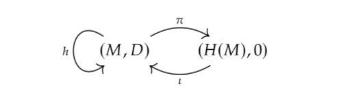

+++
author = "Elias Klakken Angelsen"
title = "Spectral sequences and multicomplexes - Part III"
date = "2022-04-05"
description = "We dive into Odins master thesis to learn about the spectral sequences of multicomplexes and how transferring homotopy saves the day."
tags = [
    "Algebraic Topology",
    "Spectral sequences",
    "Multicomplexes",
    "Reading a master thesis",
    "Mathematics",
    "Homotopy Transfer"
]
categories = [
    "Spectral sequences",
    "Math",
]
series = ["Short series - Spectral sequences and multicomplexes"]
aliases = ["Spectral sequences"]
#image = "images/3rdfront.jpg"
math = true
draft = false
+++

As promised when we started the series on spectral sequences and multicomplexes, we aimed at understanding the main results of a master thesis.
Finally, I've had the time to finish this post. I enjoyed writing it quite a lot, but I have been busy with other things, such as acting for [Realfagsrevyen](https://www.facebook.com/realfagsrevyen) and doing project work for other courses. Now that these things are more-or-less out of the way (for now), I finally managed to finish this post.
This is the final post in this short series on spectral sequences and multicomplexes, and in this post, we are trying to understand my friend [Odins thesis](https://fagkom.github.io/posts/gardaa-odin-hoff-2/).

After explaining the construction of a spectral sequence from a filtered complex and meeting the Leray-Serre sequence in the [first post](https://eka2499.github.io/p/spectral-sequences-and-multicomplexes-part-i/), 
we moved on to study the proof of the form of the $E_2$-page of this sequence, briefly touch on exact couples and compute the homology of $\Omega S^n$ in the [second post](https://eka2499.github.io/p/spectral-sequences-and-multicomplexes-part-ii/).
With these topics covered, we hopefully have enough background to cover some of the key points in [Odins thesis](https://fagkom.github.io/posts/gardaa-odin-hoff-2/) on multicomplexes and their spectral sequences.

If you do not know about these topics yet, I suggest you read at least the [first post](https://eka2499.github.io/p/spectral-sequences-and-multicomplexes-part-i/) to get a hang of it. 
Feel free to use any other (possibly more reliable) source for catching up!
I'll not pretend that I understand everything going on, but hopefully we can make sense of the main statements and questions in the thesis. 
For a more cohesive and correct treatise, take a look at [Odins thesis](https://fagkom.github.io/posts/gardaa-odin-hoff-2/).

We'll try to keep it brief and conceptual. First we try to understand multicomplexes, why they exist "in the wild", how their spectral sequences are made and why the differentials may be tricky.
After realising the higher differentials may be problematic to study, we aim towards "shifting" through the pages to obtain the higher differentials as differentials on lower pages of a shifted spectral sequence.
The ninja trick we will be using, is the Homotopy Transfer Theorem. After this, we explain how to shift the sequence in the correct way, yielding manageable access to the higher differentials. 
By this point, we should be ready to understand the main theorems of the thesis. 

 
## Multicomplexes and their associated spectral sequences

Multicomplexes can be thought of as a bicomplex with a lot of extra differentials. 
The degrees of these differentials may remind us a bit about how the differentials in spectral sequences shift, and indeed, there is a connection here.
We will meet this result later, but first, we should have a clear definition to work with.

### What is a multicomplex?

We let $k$ be a field (of characteristic $0$). To avoid extension problems, this is whats assumed throughout the entire thesis. 
Therefore, we will certainly assume the same thing.

**Definition: (Multicomplex)**

A multicomplex $(M, D_{\bullet})$ over the fixed field $k$ is a bigraded vector space $M$ over $k$, such that we have a family of linear maps $D_r : M \to M$ indexed over $r \geq 0$.
These maps shifts similarly to the differentials in a spectral sequence, as they have bidigrees $\|D_r \| = (r,1-r)$. To justify the name multicomplex for this definition, we also require

$$ \sum_{p+q = n} D_pD_q = 0$$

for all $n \geq 0$.

Before visualising what this looks like, we remark that we do not need the $D_r$'s to square to zero. If we use the name "differentials" for these maps, that will certainly be an abuse of terminology.
Nevertheless, we can always find an underlying cochain complex of graded vector spaces by considering $(M, D_0)$.

When we have an object, such as a multicomplex, we should always try to figure out how to map between them.

**Definition: (Morphisms of multicomplexes)**

If $(M,D_{\bullet})$ and $(N,\tilde{D}_{\bullet})$ are multicomplexes, a morphism 

$$f:(M,D_{\bullet}) \to (N,\tilde{D}_{\bullet})$$

should be a series of linear maps respecting the differentials. Since we have several differentials, we should have several maps such that it commutes with the sum we saw before.
Therefore, we define such a map $f$ to consist of linear maps $f_n: M \to N$ such that $f_n(M^{p,q}) \subseteq N^{p+n, q-n}$
and

$$ \sum_{p+q = n} f_pD_q = \sum_{p+q = n} \tilde{D}_pf_q.$$

Indeed, in the special cases where our multicomplex is a single cochain complex and a double complex, this becomes the requirements for being cochain maps and morphisms of double complexes, respectively.

One can show that such morphisms of multicomplexes are invertible if and only if the map $f_0$ on the underlying cochain complex is an isomorphism of cochain complexes. 
Therefore, one can take as a definition that $f$ is an isomorphism if $f_0$ is an isomorphism. The same thing can be said for quasi-isomorphisms, as the underlying cochain complex gives us a way of studying the cohomology in degree $(p,q)$.

### Where do we meet them in the wild?

The most obvious way we meet multicomplexes, is through the special cases; cochain complexes and double complexes.
Of course, generalising these to multicomplexes is a good idea, but one should ask if we can find any interesting examples of multicomplexes "in the wild". 
Most examples I could dig up were algebraic constructions, and indeed, by constructing such bigraded modules and constructing maps satisfying the requirements, we can make ourselves a lot of multicomplexes.
Readers more familiar with operads than myself, may also find several examples of multicomplexes that I do not yet understand.

There are also examples of topological multicomplexes. The great geometric analyst, Gromov, came up with a theory on multicomplexes to apply in [bounded cohomology](https://dec41.user.srcf.net/notes/IV_E/bounded_cohomology.pdf).
His work, as explored in [this paper](https://arxiv.org/pdf/1808.07307.pdf), explores a multicomplex analogue of the singular cochain complex, called the singular multicomplex.
This singular multicomplex, denoted $\mathcal{K}(X)$, can be thought of as "a multicomplex version of the singular complex". 

We will not cover these topics in this post, but we encourage readers to go on a web-spree in search of cool multicomplexes.

### How do we construct spectral sequences for multicomplexes?
We follow Odin and assume the following boundedness condition on our multicomplexes. A multicomplex, which we will continue to denote $(M,D_{\bullet})$, is said to be *bounded below* if for all $n$, there exists an integer $s(n)$ s.t. $M^{p,n-p} = 0$ if $p \geq s(n)$.
The reason we use this "vanishing down to the right" condition is that we want to consider the total complex, $\operatorname{Tot}M$.
This total complex $\operatorname{Tot}M$ is defined as $\operatorname{Tot}M^n = \oplus_{p+q = n}M^{p,q}$ with differential $D = \sum_{r\geq 0}D_r : \operatorname{Tot}M^n \to \operatorname{Tot}M^{n+1}$, which actually becomes a cochain complex. 

As illustrated in the [first post](https://eka2499.github.io/p/spectral-sequences-and-multicomplexes-part-i/) of this series, we have an idea of how to find spectral sequences for cochain complexes, if we can find a suitable filtration.

Define now the filtration $F^s\operatorname{Tot}M^n = \oplus_{p+q = n}M^{p,q}$ for $p \geq s$.
If we equip the total complex with this filtration, we get a filtered complex that inherets the boundedness condition from $(M,D_{\bullet})$, and in fact, the spectral sequence associated to this cochain complex converges to the cohomology of $\operatorname{Tot}M$.

The above mentioned spectral sequence is what we define to be the spectral sequence associated to the multicomplex, which can neatly be made by utilizing the bounded, filtered cochain structure on $\operatorname{Tot}M$.

### Beware the differentials
With a spectral sequence associated to multicomplexes in our hands, we can start to analyze the differentials. 
I honestly didn't think that I'd follow Odins thesis so closely, but he writes quite clearly and structured, with illustrative examples to showcase key points or problems. 
One of the things he mentiones is that we should keep an eye on the differentials, because spooky things may happen.
Let's understand what he is talking about.

The zeroth page of the spectral sequence is quite simple, as $$E_0^{p,q} = F^pM^{p+q}/F^{p+1}M^{p+q} = M^{p,q}.$$
For this page, the differential is just $\delta_0 = D_0$. The zeroth page does therefore just describe the underlying chain complex. 
By considering the first page $E_1^{p,q} = H^q(M^{p, \bullet}, D_0)$, we can show that the differential on this page, $\delta_1$, is induced from $D_1$ in cohomology.
As Odin (and Hurbubise) explains in the following example, this is not the case in general. 

Consider the following multicomplex, where the nonzero entries are $kx$, the one-dimensional vector spaces over $k$ with generator $x$.

One would not think that such a cute little multicomplex would create problems, but indeed it does. 
It turns out that all entries on the final page are $0$ by considering the total complex. If we consider the homology $H^q(M^{p, \bullet}, D_0)$ giving the $E_1$-page, we get the following.

Since the $E_3$-page must be the final page (by considering the degrees of the potential differentials), we know that all entries must be killed off before we arrive at this page. 
The only differentials that may influence the nonzero entries, are the differentials on the $E_2 = E_1$-page. 
This means that there must be a nonzero $\delta_2: ka \to kd$, but this cannot be induced from $D_2$, as $D_2 = 0$.

It would be nice if $\delta_r$ was induced from $D_r$, but this is not the case. 
Fortunately, as we will see, we can utilise cohomology a bit to amend this completely for bicomplexes and for $D_2$ in the general case, but the higher differentials become quite complex (pun intended) to study in the general case.

## Transferring homotopy
In this next section, Odin explains how we can transfer multicomplex structures (i.e. compatible higher differentials) to a cochain complex isomorphic to the underlying cochain complex of our multicomplex.
Before we see the magic, we'll quickly recall some notions from the homotopy theory of cochain complexes.

### Preliminary definitions on homotopy of cochain complexes
Given cochain complexes $M$ and $N$, recall that a *homotopy retract* from $M$ to $N$, $(\pi, i, h)$, consists of cochain maps $\pi: M \leftrightarrow N: i$ and a homotopy $h:M \to M$, which is a map of degree $-1$ such that $i\pi - id_M = Dh+hD$ and either $i$ or $\pi$ are quasi-isomorphisms. To upgrade a homotopy retract to a *deformation retract*, we also require $\pi i = id_N$.
Indeed, a deformation retract extends to a homotopy equivalence.

An important result is the following theorem.

**Theorem: (Deformation retract to cohomology)**

If $(M,D)$ is a cochain complex over $k$, then this cochain complex admits a deformation retract $(\pi, i, h)$ to its cohomology, which can be pictured like this, which is stolen directly from [Odins thesis](https://fagkom.github.io/posts/gardaa-odin-hoff-2/).

### Transferring multicomplex structures

The idea from here on is that we can use the previous theorem to "skip a page" in the spectral sequence. The problems we encountered with the differetials first came on the $E_2$-page (at least in our example), so maybe it is possible to iterate this deformation retract to the homology-idea to skip pages from $E_i$ to $E_{i+1}$ and "only induce $D_1$'s".

To try to apply this idea, we need higher differentials on the cohomology.
The way we are going to induce the higher differentials from our multicomplex over to the cohomology, is through the Homotopy Transfer Theorem (also called HTT). 

The theorem is a mouthful, but the idea is that by throwing differentials back and forth through the homotopy of an underlying homotopy retract, we can induce higher differentials. 

**Theorem: (Homotopy Transfer Theorem)**
If we have a multicomplex $(M, D_{\bullet})$ and a cochain complex $(N,D_0')$ with a homotopy retract $(\pi, i, h)$ from the underlying cochain complex $(M, D_0)$ to $(N, D_0')$, we can define maps $D_n' : N \to N$ for $n \geq 1$ as
$$D_n' = \sum_{|J| = n}\pi D_{j_1 }hD_{j_2 }h\ldots hD_{j_k}i.$$
These maps does in fact induce a multicomplex structure on $N$, and the maps $i$ and $\pi$ can be made into morphisms of multicomplexes by defining $i_n = \sum_{|J| = n}hD_{j_1}hD_{j_2}h\ldots hD_{j_k}i$ and $\pi_n = \sum_{|J| = n}\pi D_{j_1}hD_{j_2}h\ldots hD_{j_k}h,$ respectively.

One can in fact show that this is well-defined with respect to different choices of homotopy retracts.

Idea: Use htpy retracts (HTT) to move multicomplex structure from M to H(M) (with fckdup indeces) to fly through the pages.

### A small detour

The idea of transferring homotopy through deformation retracts is quite useful! 
We'll not go into details right now, but my friend [Torgeir](https://torgeiraamboe.github.io/) wrote his [master thesis](https://fagkom.github.io/posts/aamboe-torgeir-2/) on formal dg-algebras, which (to my understanding) are dg-algebras where the (co)homology contains all/most of the homotopical information we care about.

He used the idea of transferring homotopies through deformation retracts and an $A_{\infty}$-algebraic version of the above result ensuring a deformation retract to the cohomology to show several results. 
It is for example known that formal dg-algebras have vanishing [Massey products](https://en.wikipedia.org/wiki/Massey_product), but using the above (and several other results), he showed that having vanishing Massey products (with some extra requirements) implies that the dg-algebra in question is formal.

We will not dive deeply into this, but you may consult his [blog](https://torgeiraamboe.github.io/) for a [summary](https://torgeiraamboe.github.io/posts/2021/on-formal-dg-algebras/).
Maybe, if we are lucky, we'll meet Massey products in a later post on this blog.

## Does HTT help?

Ok, we now have the Homotopy Transfer Theorem, and we know we can find a deformation retract from $M$ to the cohomology of $M$.
If we now consider the higher differentials given by the Homotopy Transfer Theorem induced on the cohomology of $M$ through the deformation retract from $M$ to the cohomology, we can in fact show that $$D_2' = \pi(D_1hD_1 + D_2)i$$ actually induces the second differential on the $E_2$-page in the associated spectral sequence.
Unfortunately, the pattern stops here in general, but Odin studies the differentials further in the later chapters. 
We will soon state the main results, but first, let's specialize to double complexes and see if the HTT can help.

### The case for double complexes

Assume that we have a double complex $(M,D_0,D_1)$, let $(\pi, i, h)$ be a deformation retract of $M$ to $H(M,D_0)$ and let $D_{\bullet}'$ be the transferred differentials on $H(M)$.
Since we have $D_r = 0$ for $r \geq 2$, the transferred differentials look like
$$D_1' = \pi D_1 i, \qquad  D_2' = \pi D_1hD_1 i, \quad \ldots \quad D_r' = \pi D_1hD_1h\ldots hD_1 i.$$

We won't show it, as this post is going to be long enough, but we get the following result.

**Theorem: (Induced differentials)**

The maps induced by $D_r'$ on the $E_r$-page is exactly $d_r$.

Wow! It worked! The general case is more complicated, but this tells us that we can study the differentials in spectral sequences associated to bicomplexes by studying the transferred differentials from $M$ to the cohomology of $M$, e.g. by concluding that $d_r$ vanishes if $D_r'$ vanishes.

### Shifting the sequences to obtain the main results (the general case)

Even though the case for special complexes is "simple", the general case may be messy.
First page differentials are not that different from the bicomplex case, as seen by the following theorem.
To avoid repeating ourselves, we $M$ is still a multicomplex and *the associated spectral sequence* refers to the spectral sequence associated to $M$, unless otherwise specified.

**Theorem: (First page degeneration)**

The associated spectral sequence degenerates at the $E_1$-page if and only if all transferred differentials $D_r'$ vanish.

For the higher pages, on the other hand, the differentials may be more complicated.

As we saw earlier, the differentials on the $E_2$-page are induced by $D_2'$.
The problem therefore lies with inducing the differentials from $D_r'$ where $r \geq 3$.

Odin illustrates an example similar to the one we had earlier, showing the problems with using $D_2$ instead of $D_2'$. 
The differential on the $E_2$-page could be nonzero even though the $D_2$-differential vanished.
The same problem can be shown to happen for the $D_3$-differential by jazzing up the example for $D_2$.

Even though it seems complicated, the following construction actually solves our problems. 
The idea is pushing the differentials a page to obtain new (shifted) differentials, giving a multicomplex in which the new $2$-differentials were the old $3$-differentials. 
This allows us to find transferred differentials that induce the differentials on the $E_3$-page and iterate to do this for the $E_r$-page. We are getting ahead of ourselves.

**Construction: (Shifted multicomplex)**

Given $(M, D_{\bullet})$, define $(^1M, ^1D_{\bullet})$ by setting $$^1D_r := D_{r+1}' \quad \text{and} \quad ^1M^{p,q} := H^{2p+q, -p}(M).$$
This is a new multicomplex, and indeed, we can iterate this construction to obtain a collection of multicomplexes, $(^sM, ^sD_{\bullet})$.
Define $$^sD_{r} := ^{s-1}D_{r+1} \quad \text{and} \quad ^sM :=  H^{2p+q, -p}(M, ^{s-1}D_0).$$

Indeed, this construction actually works!

**Theorem: (Shifted spectral sequence)**

The associated spectral sequence to $^1M$ is the spectral sequence associated to $M$, but shifted.
More concretely,
$$^1d_r = d_{r+1} \quad \text{and} \quad E_r^{p,q}(^1M) = E_{r+1}^{2p+q, -q}(M).$$

The iteration can be written more explicit than this.

**Corollary:**

For $r \geq 1$ and $n=p+q$, we have $$d_r = ^rD_0 \quad \text{and} \quad E_r^{p,q} = ^rM^{p-rn, q+rn}.$$

An easy corollary from the theorem above tells us that the transferred differentials actually contain all the information we are after, if we shift them appropriately.

**Corollary: (Degeneration of the $k$'th page)**

The associated spectral sequence to $M$ degenerates on the $k$'th page if and only if for all $r \geq 0$, the transferred and shifted differentials vanish, i.e. $^kD_r = 0$.

## Closing remarks

It should be said that this blog post follows Odins thesis closely, so close to all of the underlying work here is his (or work of the people he refers to). 
Nevertheless, I quite enjoyed reading his thesis, and as mentioned at the [start](https://eka2499.github.io/p/spectral-sequences-and-multicomplexes-part-i/) of this series on spectral sequences, I felt like it was about time to actually understand spectral sequences properly. 
This tour has certainly helped with that quest.

Odin also spends some time in the appendices explaining how operads enter the game and how they describe double complexes and multicomplexes. He continues to explain that multicomplexes are actually "homotopy double complexes", whatever that means. 
Even though we have not talked about it here (or even understood it), we can see that this gives some vague pointers to the fact that the transferred differentials that "fixed" double complexes also should be able to "fix" multicomplexes, if tweaked correctly.
I cannot guarantee that we will encounter operads soon, but I have promised my friend Thomas to proofread his soon-to-be-finished master thesis, so there may be more posts related to this topic in the foreseeable future.

This concludes the post. Hopefully, I have more time now that I am done acting with [Realfagsrevyen](https://www.facebook.com/realfagsrevyen) for the season and making an outdoor [biodiversity game](https://biodivgame.github.io/) for the mandatory course "Experts in Teamwork" that we have here at NTNU. 
This may result in more frequent posting here on the blog, as I crave to write about my [seminar on $\infty$-categories](https://folk.ntnu.no/runegha/seminar.html) and [Differential Cohomology](https://arxiv.org/abs/2109.12250), which will be the topic of my master thesis next year.
