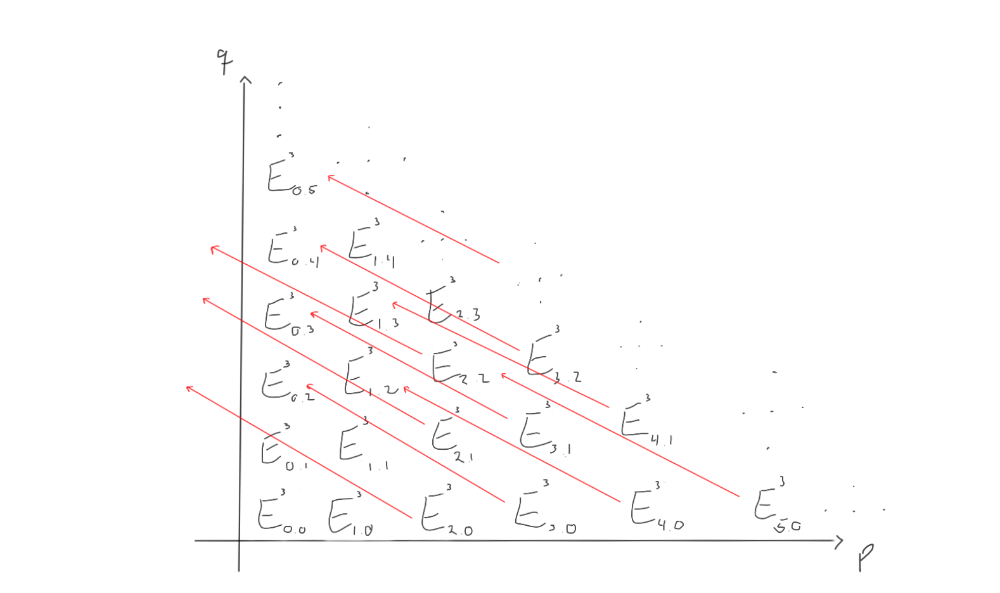
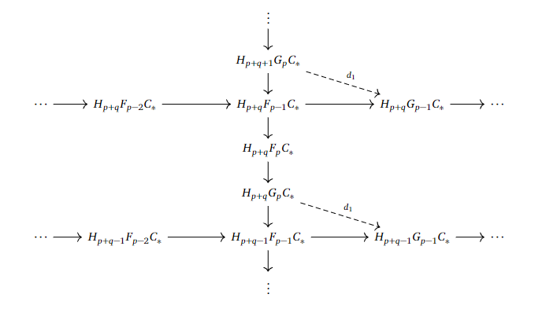

+++
author = "Elias Klakken Angelsen"
title = "Spectral sequences and multicomplexes - Part I"
date = "2022-02-03"
description = "We start the blog by diving into a mini-series on spectral sequences, aiming to understand a master thesis on the topic."
tags = [
    "Algebraic Topology",
    "Spectral sequences",
    "Fibrations",
    "Filtered complexes",
    "Homology and cohomology",
    "Mathematics",
]
categories = [
    "Spectral sequences",
    "Math",
]
series = ["Short series - Spectral sequences and multicomplexes"]
aliases = ["Spectral sequences"]
image = "images/SpecSeqds2.png"
math = true
draft = false
+++

A year ago, I took a course on algebraic topology at NTNU where we covered some homotopy theory, spectral sequences, bundle theory and characteristic classes. 
Most of the topics stuck with me, and I have been exploring them a bit after the course. The part on spectral sequences grew on me, and at the end of the course, that part fascinated me the most, as they give a puzzle-style way of computing homology and cohomology.
Even though I realised that they were powerful tools, there were a lot of technicalities that I just "accepted" when it came to spectral sequences. 
I have not been using them, or even thinking about them, for a while now, and I thought it would be nice to "open the blackbox" to understand them properly.

A fellow student of mine, Odin, recently handed in his master thesis in algebraic topology where he explored the spectral sequence associated to a multicomplex over a field.
Trying to understand the main essence of the results in his thesis is what lead me to writing this post. 
We will start the mathematical exploration of this blog with an introduction to spectral sequences before we delve into the main results in Odins master thesis in some later post.

## What is a spectral sequence?

Loosely speaking, a (co)homological spectral sequence consists several *pages* of chain complexes of abelian groups such that the pages are connected by (co)homology.
The idea we will try to capsule into the spectral sequence is that we will make a finer and finer approximation to the homology of a space. 
Between the abelian groups, we have differentials that "shift" their angle for each page we iterate through, allowing us to gather up some new (finer) info in homology for each page. 
Information of the homology of what from what, you may ask? We'll come to that. First we explore the mechanisms of a spectral sequence, so that we can more easily grasp the technicalities they originated from.

To reveal some of the notation before we derive the ideas ourselves, it is common (up to convention) to write $(E^r_{**}, d^r_{* *}).$ This indicates that we would have abelian groups $E^r_{p,q}$ in a grid and differentials $d^r_{p,q} : E^r_{p,q} \to E^r_{p-r,q+r-1}$ squaring to zero on the $r$'th page.

Let's try to visualise what this is supposed to look like if we try to work with a spectral sequence. 
First of all, we have abelian groups in a grid, indexed by which page $r$ we are working on.

Between these groups, we are supposed to have differentials moving left and up, depending on which page we are working on.
Let's try to visualise what the $d_1, d_2$ and $d_3$ differentials look like on this page.

When we move to the later pages (e.g. $r=2$ or $r=3$), the differentials change. Keep in mind that the groups also change, as we move through the pages by taking homology with respect to the differentials we just worked with.
For $r=2$, the page could look like the following:
 

How does this look for $r=3$ then? Let's take a look!

Ok. What we can see now, is that as we progress through the pages, the differentials more and more often end up left of the first quadrant, and hence vanish, as all the abelian groups outside the first quadrant is zero in this *first quadrant spectral sequence*.
This would mean that for a sufficiently large $r$, all the differentials end up outside of the first quadrant and vanish. When taking homology with zero as the differentials, we just end up with the same thing.
Therefore, for a sufficiently large $r$, we have

$$E_{p,q}^r = E_{p,q}^{r+1}=\cdots=E_{p,q}^{\infty},$$

and we say that the sequence *degenerates* at page $r$.

This terminal page is where the magic happens. As we have (in some sense that will become clear later) included finer and finer homological data, we may actually find some sort of homological information here. Exactly why this is a good idea to do, is yet to be explained.
Before we answer the question on where these ideas come from, we ask whether or not there are any interesting spectral sequences we can consider.
The example we will come back to and try out a bit, is the Leray-Serre spectral sequence. This may often be stated as a theorem, as its convergence is certainly not to take for granted.

**Theorem: (The Leray-Serre Spectral Sequence)**

Assume $F \hookrightarrow E \to B$ is a fibration where $\pi_0(E) = 0$ and $\pi_1(B)=0$ (even better, assume that $\pi_1(B)$ acts trivially on $H_*(F)$ and the result still holds).

Then there is a convergent first quadrant spectral sequence with $E^2$-page given by
$$ E^2_{p,q} = H_p(B;H_q(F)) \Rightarrow H_{p+q}(E).$$
 
How can we think of this? Well, we just visualised a grid of abelian groups, and this theorem says that we can choose the entries in the grid on the second page to contain information about the homology of the base space and the fiber in a fibration to retrieve information about the homology of the total space when iterating through the pages.

Ok, we have some words to clarify before we understand this.
What is a fibration and how would such a weird mix-up of homology groups converge to anything, let alone the homology of $E$? There are a lot of questions to be answered, but we'll come back to them. We will take a detour to homotopy theory to understand fibrations.

## A detour to homotopy theory

Even though you can do a post about spectral sequences without touching that much topology, we visit homotopy theory.
Fibrations come from homotopy theory, and along with the notions of weak equivalences and cofibrations (the dual notion of fibrations), they make up the stepping stones for the theory. 
In fact, if we would want to do homotopy theory in other contexts (that is, in other categories), we couldn't necessarily just "continuously deform" or "draw a continuous path" between homotopic functions. 
We would need the categorical notion of a model category, which is specified by fibrations, cofibrations and weak equivalences. We may encounter them in later posts, but for now, we won't dwell on these ideas before we have worked a bit with fibrations. Fibrations are maps with a special property, namely the *homotopy lifting property*.

**Definition: (Homotopy Lifting Property)**

Given a map of topological spaces $p: E \to B$, we say $p$ has the *homotopy lifting property* with respect to a space $X$ if, given a homotopy $g_t: X \to B$ and a lift $\tilde{g_0}:X \to E$ of the starting map $g_0$ in the homotopy, 
there exists a homotopy $\tilde{g_t}:X \to E$ lifting $g_t$ and extending $\tilde{g_0}$. Phrased as a diagram:

**Definition: (Fibration)** 

A *fibration* $p: E \to X$ is a map having this homotopy lifting property with respect to all topological spaces $X$.

We call $F_x := p^{-1}(x)$ the fiber at $x$. If the base space $B$ is path connected, the different fibers are all homotopy equivalent. 
This leads us to talk about just *the* fiber $F$ and this justifies the notation $F \hookrightarrow E \to B$ for fibrations.

One of the most known fibrations is the Hopf fibration, 
$S^1 \hookrightarrow S^3 \to S^2$, 
where the last morphism can be given explicitly, if we wanted to.

The idea of spectral sequences is now that we can utilize the homology of $B$ and $F$ to find the homology of $E$, or even reverse-engineer it to find the homology of one of them, given that we know the homology of the two others.
This is exactly what we will do when we compute the homology of the loop space $\Omega S^n = Hom_{Top_*}(S^1,S^n)$ in a later post.

To try to visualise this idea, think of a fiber bundle $p: E \to B$. If you do not know what a fiber bundle is, think about a manifold $B$ where the total space $E$ is the space $B$, but now every point has a fiber $F$ glued on. 
The map $p$ then takes a point $(b,F_b)$ and projects down to $b$. Throw in some localising conditions (to make sure we locally glue them on in (close to) the same direction), and tada, you basically have the definition of a fiber bundle.
If the fibers are vector spaces, we call them vector bundles. Think about them as the collection of all (co)tangent spaces on your manifold, where all these spaces are glued onto the points to which they belong. This construction is quite important, so we will meet it again later, for sure.

One can show that all fiber bundle maps over paracompact base spaces are fibrations. 
The lifting condition now says that if we have a homotopy $g_t$ on our base space $B$, and a way to start the homotopy in the total space $E$, we can lift the homotopy to $E$.
Even though the homotopy is between functions, I like to think of them as paths. This would then mean that if we knew "a path" in $B$ and where it starts in $E$, we can transfer the entire "path" up to $E$ through the fibration $p$.
Now, enough with the hand waving and the homotopy theory for now. Let's get back to spectral sequences.

## Spectral sequences from filtered complexes

In the first part of this post, we drew some grids of abelian groups and had some differentials going weird directions. For now, we start from scratch, kind of forgetting what we did in the earlier sections.

Recall that we often find ourselves in situations where we have a space $X$ and a subspace $A$. Often, we also can consider triplets of spaces $A \subset B \subset X$.
These will both yield long exact sequences in homology that relate the homology of these spaces. Note that if we consider the singular $n$-chains, we will get a sequence of inclusions 
$C_n(A) \hookrightarrow C_n(B) \hookrightarrow C_n(X)$, and indeed, if we avoid choosing an $n$, we get a sequence of chain complexes $C_ * (A) \hookrightarrow C_ * (B) \hookrightarrow C_*(X)$ that contain a lot of the homological information relating these. 
If we want, we can apply homology to get a sequence looking quite similar.
A natural question to ask is whether or not we can try to utilize this sort of filtration to compute homology levelwise and make it "converge" to the homology of $X$.

If we have $A \subset B \subset X$ or even $A \subset B \subset C \subset X$, what info do we need about the homologies related to the subspaces of $X$ before we can compute the homology of $X$?
To be intentionally vague, we can set up the homologies after each other, with the respective homologies of the quotient spaces.

A similar story can be told for the longer filtrations.

It looks like we "only" need the homologies of the subspaces with their respective quotients to compute the homologies upwards in this chain.
If we can properly define what a filtration is supposed to mean, and actually work out whow this "levelwise" construction is supposed to work, then we are possibly onto some sort of idea of "approximating the homology of $X$ with finer and finer information". 

**Definition: (Filtration of a module)**

A *filtration* of a module $M$ is a sequence of subspaces

$$\cdots \subset F_{-1}M \subset F_0M \subset F_1M \subset \cdots$$

such that their union is $M$ and their intersection is $\empty$.

**Definition: (Filtered complex)**

A filtered complex is a chain complex $(C,\partial)$  such that we have a filtration on each entry preserving the boundary map, i.e. each $C_i$ has a filtration such that $\partial F_jC_i \subset F_jC_{i-1}$.

One should note that $F_pC_ * $ is a subcomplex of $C_*$, so we have basically just filtered the entire complex at the same time. 

We can try to utilise the idea from earlier about finding the information about the quotient spaces, and construct the associated graded module from a filtered module.

**Definition: (Associated graded module)**

Given a filtration on a module $M$, we can define the *associated graded module* 

$$GM = \bigoplus_{i \in \mathbb{Z}}G_iM,$$

where $G_iM = F_iM/F_{i-1}M$.

As in the previous case, we can do the same thing for complexes.

**Definition: (Associated graded complex)**

Given a filtered complex $C_*$, we can define the *associated graded complex*

$$G_pC_* = F_pC_* / F_{p-1}C_* , $$

where the quotient is taken as chain complexes.

**Remark:** The filtration on $C_ * $ induces a filtration on its homology, so we can in fact talk about the graded structures on the homology of $C_* $ as well.

Recall that if we consider a (good) pair of spaces $A \subset X$, we can in fact compute $H(X)$ from $H(A)$ and $H(X/A)$ up to some extension problem, as illustrated above.
If we can pick a filtration of $C_ * $ with easily computeable homology, maybe we can compute the homology of $C_ *$ itself, in nice enough contexts!

Ok, now you can again recall what we did in the first section. 
A spectral sequence is supposed to consist of a grid of abelian groups (or modules) $E^r_{p,q}$ with differentials $d^r_{p,q} : E^r_{p,q} \to E^r_{p-r,q+r-1}$, whatever that means. 
Since the differentials shift and move further and further away as we progress towards the pages, a suitable boundedness condition may ensure that all of these differentials vanish, at some point, meaning that the sequence *degenerates*.
For example, this happens in the Leray-Serre sequence, as that spectral sequence is a first quadrant sequence. 

A natural question, following what we just did, is whether or not we can just plug the groups $H_* (G_pC_ * )$ into some spectral sequence and hope that this spits out information about $H_* (C_ * )$ on the $E^{\infty}$-page.
We are close to the answer.

**Theorem: (Existence of a spectral sequence)**

If we are given a filtered complex $C_ * $ with some filtration $F$ as in the above definitions, there exists a spectral sequence $E$ such that $E_{p,q}^{\infty}$ is equal to $G_pH_{p+q}(C_ * )$.

Wow! On the final page, we can actually find all the steps in the filtration of the homology of $C_ * $!

In this situation, we say that $E$ *abuts* or *converges* to $H_{p+q}(C_ * )$, as in the case of the Leray-Serre spectral sequence.

We will not prove this, as the post is already long enough, but we will try to understand a bit where this comes from.

### The main idea

It is (almost) natural to take $E_{p,q}^0$ to be $G_pC_{p+q}$. The most natural choice would be to consider $G_pC_q$, but it turns out that everything gets hard if we do that.
The differential $d_0$ can only be chosen to be the boundary map $E_{p,q}^0 = G_pC_{p+q} \to G_pC_{p+q-1} = E_{p,q-1}^0$.
Just to see what this would look like, let's bring up the grid again.

Now, if we take homology with respect to $d_0$, what happens? We define the $E^1$-page!

The $E^1$-page becomes $E^1_{p,q} = H_{p+q}(G_pC_ * )$. If we want to find the differential $d_1$, we couldn't base it on $d_0$, as we already killed off every single image of $d_0$ when taking homology. Nevertheless, there is a way!
Recall that we want to have a map from one of the $E^1_{p,q} = H_{p+q}(G_pC_ * )$ to a $E^1_{p',q'} = H_{p'+q'}(G_{p'}C_ * )$.

If we consider the filtrations we have worked with earlier, we may find something interesting. For example, we can consider the short exact sequences 

$$0 \to F_{p-1}C_ * \to F_pC_ * \to G_pC_ * \to 0$$

and

$$0 \to F_{p-2}C_ * \to F_{p-1}C_ * \to G_{p-1}C_ * \to 0.$$

Since we have $F_{p-1}C_ * $ in both of them, we may be able to link $G_pC_ * $ to $ G_{p-1}C_ * $.
We want to link them in homology, so by taking the long exact sequences in homology, we can just trace the following web of arrows to define $d_1$ as the composition of the crossing arrows from both of the long exact sequences.

This arrow goes straight to the left and gives us in fact a new differential, as $d_1 ^2 = 0$, which could be seen by tracing out what $d_1^2$ would look like. 

With this, we could take homology again, yielding the $E^2$ page and the respective $E_{p,q}^2$-groups.
The differential is a little bit more involved, but through a similar prosedure as for $d_1$, with some lifting of homology classes to representatives, one can make a well-defined differential $d_2: E_{p,q}^2 \to E_{p-2,q+1}^2$.

After this point, one can continue in a similar fashion to produce all the pages that will determine the filtration of the yet unknown homology of $C_* $.
There are of course a lot of details to be checked, so we refer interested readers to [this writeup](https://r0hilp.github.io/assets/docs/serre_spectral_sequence.pdf) for the details.

In this post, we have done a lot of the "dirty work" when it comes to understanding spectral sequences. 
We will probably see some applications of this in the next post, using the Leray-Serre Spectral Sequence to compute the homology of $\Omega S^n$, illustrating the beautiful methods of computing homology we have developed.  
Until next time, check out [this amazing video](https://www.youtube.com/watch?v=OnvQggy3Ezw) on freediving! 

